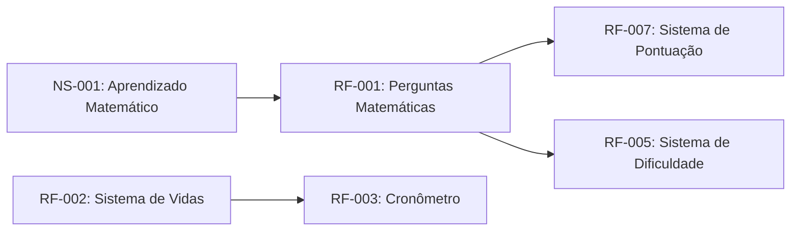

# SpaceMath: Jogo Educacional de Matemática

## 1. Introdução

### 1.1 Propósito do Projeto

Este documento apresenta os requisitos funcionais e não-funcionais do projeto SpaceMath, desenvolvido pela equipe com base no padrão IEEE 29148:2018.

O objetivo do projeto é criar um jogo educacional com temática espacial voltado ao ensino de matemática básica, utilizando mecânicas interativas para estimular o aprendizado do jogador.

### 1.2 Escopo

O SpaceMath será um jogo digital onde o jogador deverá resolver desafios matemáticos para avançar pelas fases.

O sistema contará com:

* operações matemáticas;
* níveis de dificuldade;
* sistema de vidas;
* cronômetro;
* pontuação;
* ranking de jogadores;
* interface temática espacial.

### 1.3 Integrantes da Equipe

* Eduardo N.
* Felipe R.
* Beatriz B.
* Lívia M.

### 1.4 Definições e Acrônimos

* **RF**: Requisito Funcional
* **RNF**: Requisito Não-Funcional
* **UI**: User Interface
* **UX**: User Experience
* **Sprint**: Período de desenvolvimento do projeto
* **Kanban**: Método visual de organização de tarefas

### 1.5 Referências

* IEEE 29148:2018 - Systems and Software Engineering
* GitHub Project Kanban
* Scratch Documentation
* (escrever outras referências utilizadas aqui)

---

## 2. Descrição Geral

### 2.1 Perspectiva do Produto

O SpaceMath será desenvolvido utilizando Scratch, com foco em acessibilidade, aprendizado e interação visual.

O jogador controlará uma nave espacial enquanto responde perguntas matemáticas para avançar no jogo.

### 2.2 Objetivos do Sistema

* Incentivar o aprendizado matemático.
* Tornar o ensino mais interativo.
* Desenvolver raciocínio lógico.
* Criar uma experiência divertida e educativa.

### 2.3 Funcionalidades Principais

* Sistema de perguntas matemáticas
* Controle de pontuação
* Sistema de vidas
* Cronômetro
* Ranking
* Mudança de dificuldade
* Nave espacial controlável
* Feedback visual para acertos e erros

---

## 3. Requisitos Específicos

### 3.1 Requisitos Funcionais

#### RF-001: Sistema de Perguntas Matemáticas

**Descrição**: O sistema deve gerar perguntas matemáticas para o jogador responder durante a partida.

**Prioridade**: Alta

**Critérios de Aceitação**

* [ ] Gerar perguntas automaticamente
* [ ] Exibir alternativas ou campo de resposta
* [ ] Validar respostas corretas e incorretas
* [ ] Atualizar pontuação após resposta

**Dependências**: Nenhuma

---

#### RF-002: Controle da Nave Espacial

**Descrição**: O jogador deve controlar uma nave espacial durante a partida.

**Prioridade**: Média

**Versão**: 1.0

**Data**: 2026-05-13

**Critérios de Aceitação**

* [x] Nave responder aos comandos
* [x] Movimentação fluida
* [x] Limite de movimentação na tela
* [x] Colisão funcionando corretamente (A fazer RF-009)
* [x] Sistema de disparos

**Dependências**: Nenhuma

---

#### RF-003: Sistema de Inimigos

**Descrição**: O sistema deve criar e gerenciar inimigos que se movimentam pela tela e interagem com a nave do jogador, representando os obstáculos matemáticos do jogo.

**Prioridade**: Alta

**Versão**: 1.0 

**Data**: 2026-05-13

 **Critérios de Aceitação**

 * [x] Inimigos surgem na tela
 * [x] Se movem de forma autônoma
 * [x] Possui colisão

---

#### RF-004: Sistema de Vidas

**Descrição**: O sistema deve controlar a quantidade de vidas do jogador durante a partida.

**Prioridade**: Alta

**Critérios de Aceitação**

* [ ] Jogador inicia com número definido de vidas
* [ ] Erros reduzem vidas
* [ ] Encerrar jogo ao atingir zero vidas
* [ ] Exibir vidas na interface

**Dependências**: RF-002

---

#### RF-005: Sistema de Cronômetro

**Descrição**: O sistema deve possuir um cronômetro para limitar o tempo de resposta do jogador.

**Prioridade**: Baixa

**Critérios de Aceitação**

* [ ] Cronômetro iniciar ao começo da fase
* [ ] Tempo reduzir continuamente
* [ ] Encerrar rodada quando tempo acabar
* [ ] Exibir tempo restante na tela

**Dependências**: Nenhuma

---

#### RF-006: Sistema de Ranking e Pontos

**Descrição**: O sistema deve registrar a pontuação final dos jogadores.

**Prioridade**: Média

**Versão**: 1.0

**Data**: 2026-05-13

**Critérios de Aceitação**

* [ ] Registrar pontuação do jogador
* [ ] Exibir ranking final
* [ ] Ordenar jogadores por pontuação
* [ ] Atualizar ranking automaticamente
* [x] Contabilizar pontuação por inimigo destruido

**Dependências**: Nenhuma

---

#### RF-007: Sistema de Dificuldade

**Descrição**: O sistema deve alterar a dificuldade das perguntas conforme o progresso do jogador.

**Prioridade**: Média

**Versão**: 1.0

**Data**: 2026-05-13

**Critérios de Aceitação**

* [x] Possuir níveis fácil, médio e difícil
* [x] Alterar dificuldade manualmente ou automaticamente
* [ ] Aumentar complexidade das operações
* [ ] Ajustar velocidade do jogo

**Dependências**: Nenhuma

---

**Dependências**: Nenhuma

---

#### RF-008: Tela Inicial

**Descrição**: O sistema deve exibir uma tela de inicio no começo do jogo, apresentando titulo e opções de dificuldade.

**Prioridade**: Média 

**Versão**: 1.0 

**Data**: 2026-05-13

**Critérios de Aceitação**

* [x] Tela inicial é exibida no inicio ou fim do jogo

**Dependências**: RF-006

---

#### RF-009: Tela Final

**Descrição**: O sistema deve exibir uma tela de encerramento ao término do jogo, apresentando o resultado da partida e oferecendo opção de reinício.

**Prioridade**: Média 

**Versão**: 1.0

**Critérios de Aceitação**

* [ ] A tela final é exibida ao zerar vidas ou o tempo
* [ ] Exibe resultado da partida, como níveis e pontuação

**Dependências**: RF-003, RF-004, RF-005

---

#### RF-010: Sistema de Perguntas e Respostas

**Descrição** O sistema deve exibir perguntas de acordo com a dificuldade do jogo, retirando vidas a respostas erradas e adicionando pontos a respostas certas.

**Prioridade**: Alta

**Versão**: 1.0

**Critérios de Aceitação**

* [ ] O sistema deve gerar perguntas após o usuário atingir um inimigo com um disparo
* [ ] Aceita respostas corretas e soma pontos
* [ ] Nega respostas erradas e subtrai vida
* [ ] Aceita apenas números diante a resposta da equação
* [ ] Aumentar dificuldade das perguntas de acordo com a dificuldade escolhida pelo jogador

**Dependências**: RF-001, RF-002, RF-003, RF-004, RF-006, RF-007

---

## 3.2 Requisitos Não-Funcionais

#### RNF-001: Desempenho

**Descrição**: O jogo deve executar sem travamentos durante a partida.

**Categoria**: Desempenho

**Prioridade**: Alta

**Métrica**:

* Resposta visual inferior a 1 segundo
* Transições fluidas entre telas

---

#### RNF-002: Usabilidade

**Descrição**: O sistema deve possuir interface intuitiva e fácil de utilizar.

**Categoria**: Usabilidade

**Prioridade**: Alta

**Critérios**

* Interface organizada
* Botões identificáveis
* Informações visíveis ao jogador

---

#### RNF-003: Compatibilidade

**Descrição**: O projeto deve funcionar corretamente na plataforma Scratch.

**Categoria**: Compatibilidade

**Prioridade**: Média

---

#### RNF-004: Manutenibilidade

**Descrição**: O código e blocos do Scratch devem estar organizados para facilitar futuras alterações.

**Categoria**: Manutenção

**Prioridade**: Média

---

## 4. Organização do Projeto

### 4.1 Repositório GitHub

Repositório do Projeto:

[SpaceMath Repository](https://github.com/FelipeFerreiraRodrigues/LER_Kanban-Scratch?utm_source=chatgpt.com)

Quadro Kanban:

[Kanban do Projeto](https://github.com/users/FelipeFerreiraRodrigues/projects/2/views/1?utm_source=chatgpt.com)

---

## 5. Registro de Desenvolvimento

### 5.1 Modelo de Registro Diário

## Atualização - 13/05/2026

### Integrantes Presentes
- Eduardo N.
- Felipe R.
- Beatriz B.
- Lívia M.

### Prints da Sprint
* Começo do Sprint 1

* Meio do Sprint 1

* Fim do Sprint 1 e Começo do Sprint 2

* Meio do Sprint 2

* Fim do Sprint 2

* Começo do Sprint 3

### Dificuldades Encontradas
- Velocidade de processamento do Scratch, foi necessário adaptações.

### Soluções Aplicadas
- Não realizar leitura de estado simultâneamente

### Próximos Passos
- Programar sistema de perguntas e respostas;
- Programar sistema de vidas;
- Programar sistemas de ranking e pontos;
---

## 6 . Análise do Grupo/Kanban

#### - Como o Kanban ajudou na organização do grupo?

- O Kanban graças a sua visualidade ajudou o grupo a se organizar diante a tarefas em realização, testes, concluídas e etc.

#### - Quais gargalos surgiram?

- Dificuldades técnicas com Scratch.

#### - Houve excesso de tarefas em desenvolvimento?

- Não, pois controlamos e distribuimos as tarefas a serem feitas com o grupo todo.

#### - O quadro ajudou na comunicação?

- Sim, pois como anteriormente dito, o quadro do Kanban ajudou na distruibuição e visualização do que ser feito.

#### - Como foi feita a distribuição de tarefas?

- Como anteriormente dito, controlamos e distribuimos as tarefas com todos, claro, alguns ficaram com coisas a mais a serem feitas, mas nada que atrapalhasse o ritmo.

#### - O Scratch facilitou o desenvolvimento?

- Não, pois tivemos dificuldades técnicas diante o mesmo na criação e teste do jogo.

#### - O que poderia melhorar no fluxo da equipe?

- Em geral, não vimos nenhum problema com a equipe, visto que todos fizeram sua parte.

## 7. Rastreabilidade

---

## 8. Aprovação

### Matriz de Aprovação

| Nome       | Função         | Aprovação |
| ---------- | -------------- | --------- |
| Eduardo N. | Desenvolvedor  | ⬜ (Não Feito)        |
| Felipe R.  | Coordenador/Teste  | ⬜ (Não Feito)        |
| Beatriz B. | Designer Gráfico | ⬜ (Não Feito)     |
| Lívia M.   | Designer Gráfico/Desenvolvedora | ⬜ (Não Feito)        |
