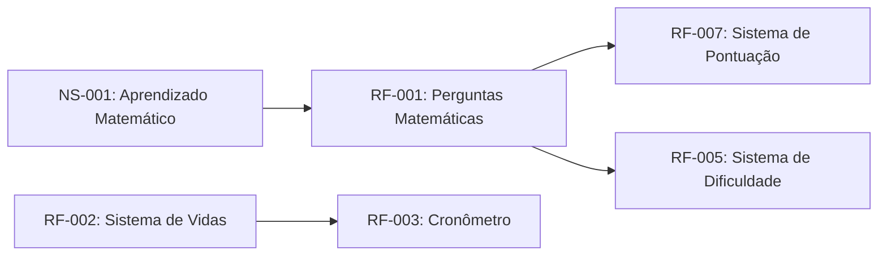

# SpaceMath: Jogo Educacional de Matemática

## 1. Introdução

### 1.1 Propósito do Projeto

Este documento apresenta os requisitos funcionais e não-funcionais do projeto SpaceMath, desenvolvido pela equipe com base no padrão IEEE 29148:2018.

O objetivo do projeto é criar um jogo educacional com temática espacial voltado ao ensino de matemática básica, utilizando mecânicas interativas para estimular o aprendizado do jogador.

### 1.2 Escopo

O SpaceMath será um jogo digital onde o jogador deverá resolver desafios matemáticos para avançar pelas fases.

O sistema contará com:

* operações matemáticas;
* níveis de dificuldade;
* sistema de vidas;
* cronômetro;
* pontuação;
* ranking de jogadores;
* interface temática espacial.

### 1.3 Integrantes da Equipe

* Eduardo N.
* Felipe R.
* Beatriz B.
* Lívia M.

### 1.4 Definições e Acrônimos

* **RF**: Requisito Funcional
* **RNF**: Requisito Não-Funcional
* **UI**: User Interface
* **UX**: User Experience
* **Sprint**: Período de desenvolvimento do projeto
* **Kanban**: Método visual de organização de tarefas

### 1.5 Referências

* IEEE 29148:2018 - Systems and Software Engineering
* GitHub Project Kanban
* Scratch Documentation
* (escrever outras referências utilizadas aqui)

---

## 2. Descrição Geral

### 2.1 Perspectiva do Produto

O SpaceMath será desenvolvido utilizando Scratch, com foco em acessibilidade, aprendizado e interação visual.

O jogador controlará uma nave espacial enquanto responde perguntas matemáticas para avançar no jogo.

### 2.2 Objetivos do Sistema

* Incentivar o aprendizado matemático.
* Tornar o ensino mais interativo.
* Desenvolver raciocínio lógico.
* Criar uma experiência divertida e educativa.

### 2.3 Funcionalidades Principais

* Sistema de perguntas matemáticas
* Controle de pontuação
* Sistema de vidas
* Cronômetro
* Ranking
* Mudança de dificuldade
* Nave espacial controlável
* Feedback visual para acertos e erros

---

## 3. Requisitos Específicos

### 3.1 Requisitos Funcionais

#### RF-001: Sistema de Perguntas Matemáticas

**Descrição**: O sistema deve gerar perguntas matemáticas para o jogador responder durante a partida.

**Prioridade**: Alta

**Versão**: 1.0

**Data**: 2026-05-22

**Critérios de Aceitação**

* [ ] Gerar perguntas automaticamente
* [ ] Exibir alternativas ou campo de resposta
* [ ] Validar respostas corretas e incorretas
* [ ] Atualizar pontuação após resposta

**Dependências**: Nenhuma

---

#### RF-002: Sistema de Vidas

**Descrição**: O sistema deve controlar a quantidade de vidas do jogador durante a partida.

**Prioridade**: Alta

**Versão**: 1.0

**Data**: 2026-05-22

**Critérios de Aceitação**

* [ ] Jogador inicia com número definido de vidas
* [ ] Erros reduzem vidas
* [ ] Encerrar jogo ao atingir zero vidas
* [ ] Exibir vidas na interface

**Dependências**: RF-001

---

#### RF-003: Sistema de Cronômetro

**Descrição**: O sistema deve possuir um cronômetro para limitar o tempo de resposta do jogador.

**Prioridade**: Média

**Versão**: 1.0

**Data**: 2026-05-22

**Critérios de Aceitação**

* [ ] Cronômetro iniciar ao começo da fase
* [ ] Tempo reduzir continuamente
* [ ] Encerrar rodada quando tempo acabar
* [ ] Exibir tempo restante na tela

**Dependências**: RF-001

---

#### RF-004: Sistema de Ranking

**Descrição**: O sistema deve registrar a pontuação final dos jogadores.

**Prioridade**: Média

**Versão**: 1.0

**Data**: 2026-05-22

**Critérios de Aceitação**

* [ ] Registrar pontuação do jogador
* [ ] Exibir ranking final
* [ ] Ordenar jogadores por pontuação
* [ ] Atualizar ranking automaticamente

**Dependências**: RF-001

---

#### RF-005: Sistema de Dificuldade

**Descrição**: O sistema deve alterar a dificuldade das perguntas conforme o progresso do jogador.

**Prioridade**: Média

**Versão**: 1.0

**Data**: 2026-05-22

**Critérios de Aceitação**

* [ ] Possuir níveis fácil, médio e difícil
* [ ] Alterar dificuldade manualmente ou automaticamente
* [ ] Aumentar complexidade das operações
* [ ] Ajustar velocidade do jogo

**Dependências**: RF-001

---

#### RF-006: Controle da Nave Espacial

**Descrição**: O jogador deve controlar uma nave espacial durante a partida.

**Prioridade**: Média

**Versão**: 1.0

**Data**: 2026-05-22

**Critérios de Aceitação**

* [ ] Nave responder aos comandos
* [ ] Movimentação fluida
* [ ] Limite de movimentação na tela
* [ ] Colisão funcionando corretamente

**Dependências**: Nenhuma

---

#### RF-007: Sistema de Pontuação

**Descrição**: O sistema deve calcular a pontuação do jogador conforme desempenho.

**Prioridade**: Alta

**Versão**: 1.0

**Data**: 2026-05-22

**Critérios de Aceitação**

* [ ] Adicionar pontos por acertos
* [ ] Remover ou reduzir pontos por erros
* [ ] Exibir pontuação em tempo real
* [ ] Mostrar resultado final da partida

**Dependências**: RF-001

---

## 3.2 Requisitos Não-Funcionais

#### RNF-001: Desempenho

**Descrição**: O jogo deve executar sem travamentos durante a partida.

**Categoria**: Desempenho

**Prioridade**: Alta

**Métrica**:

* Resposta visual inferior a 1 segundo
* Transições fluidas entre telas

---

#### RNF-002: Usabilidade

**Descrição**: O sistema deve possuir interface intuitiva e fácil de utilizar.

**Categoria**: Usabilidade

**Prioridade**: Alta

**Critérios**

* Interface organizada
* Botões identificáveis
* Informações visíveis ao jogador

---

#### RNF-003: Compatibilidade

**Descrição**: O projeto deve funcionar corretamente na plataforma Scratch.

**Categoria**: Compatibilidade

**Prioridade**: Média

---

#### RNF-004: Manutenibilidade

**Descrição**: O código e blocos do Scratch devem estar organizados para facilitar futuras alterações.

**Categoria**: Manutenção

**Prioridade**: Média

---

## 4. Organização do Projeto

### 4.1 Repositório GitHub

Repositório do Projeto:

[SpaceMath Repository](https://github.com/FelipeFerreiraRodrigues/LER_Kanban-Scratch?utm_source=chatgpt.com)

Quadro Kanban:

[Kanban do Projeto](https://github.com/users/FelipeFerreiraRodrigues/projects/2/views/1?utm_source=chatgpt.com)

---

## 5. Registro de Desenvolvimento

### 5.1 Modelo de Registro Diário

## Atualização - DD/MM/AAAA

### Integrantes Presentes
- Eduardo N.
- Felipe R.
- Beatriz B.
- Lívia M.

### Tarefas Realizadas
- (descrever atividade realizada)
- (descrever implementação feita)
- (descrever correções realizadas)

### Prints da Sprint
(colocar print aqui)

### Dificuldades Encontradas
- (escrever dificuldades)

### Soluções Aplicadas
- (escrever soluções)

### Próximos Passos
- (escrever próximos objetivos)
---

## 6. Controle de Versões

### 6.1 Histórico de Alterações

| Versão | Data                 | Autor                     | Modificação                  |
| ------ | -------------------- | ------------------------- | ---------------------------- |
| 1.0    | 2026-05-22           | Eduardo N.                | Criação inicial do documento |
| 1.1    | (escrever data aqui) | Equipe de Desenvolvimento | (escrever alteração aqui)    |

---

## 7. Rastreabilidade

---

## 8. Aprovação

### Matriz de Aprovação

| Nome       | Função         | Aprovação |
| ---------- | -------------- | --------- |
| Eduardo N. | Desenvolvedor  | ⬜         |
| Felipe R.  | Desenvolvedor  | ⬜         |
| Beatriz B. | Desenvolvedora | ⬜         |
| Lívia M.   | Desenvolvedora | ⬜         |
